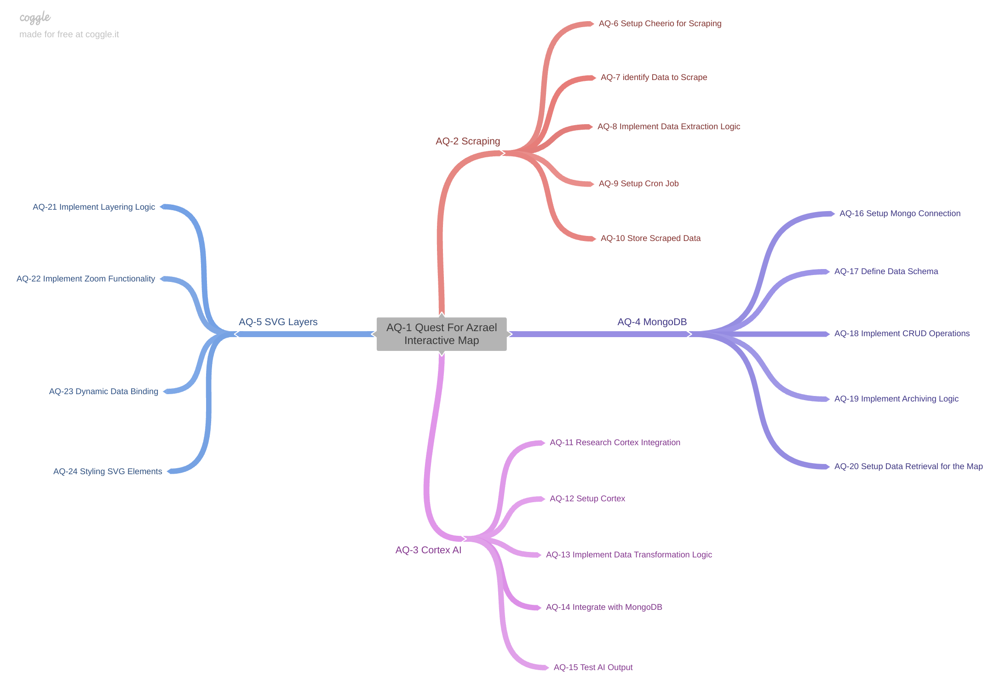

# Quest For Azrael

## Interactive Map

### Project Overview

This project is implementation of an interactive map for a hungarian fantasy forum based, play-by-post RPG.

### Architecture Overview

This project consists of several key components:

1. Custom SVG Layers for rendering the interactive map.
2. CheerioJS for scraping real-time data from the game’s website.
3. Ollama AI for processing and translating scraped data.
4. MongoDB for storing data about characters and quests.
5. NextJS+ReactJS for building the application and fetching/displaying data.
6. Displaying the World Map

---

1. Custom SVG Layers

   - Integration: SVGDOTJS is integrated into the Next.js applicationn.
   - Base Map: The world map is displayed using a base layer, which could be a static image.

   Layer Management

   - Dynamic Layers: Different data types (e.g., character locations, quests) are displayed on separate layers that can be toggled on and off.
   - Base Layer: Initialize and configure the base layer to represent the fantasy world map.

2. Data Scraping with CheerioJS

   Workflow

   - Web Scraping: Use CheerioJS in a Node.js script to periodically scrape data from the game’s website.
   - Data Parsing: Extract relevant information such as character locations and quest statuses from the HTML.

3. Process scraped data with Ollama AI

   Process and translate scraped data from CheerioJS with Ollama AI to be displayed on interactive map.

4. Storing Data in MongoDB

   Database Design

   - Collections: Data is organized into collections such as characters and quests.
   - Structure: The data model is designed to facilitate easy querying and updating.

   Temporary vs. Permanent Storage

   - Temporary Storage: Data is stored temporarily during scraping and processing.
   - Permanent Storage: Use MongoDB for persistent storage to support historical tracking and analytics.

5. Fetching Data with NextJS+ReactJS

   API Routes

   - Setup: API routes are used to fetch data from MongoDB and serve it to the front-end.

   Client-Side Data Fetching

   - Fetching Data: In Next.js components, data is fetched using TanStack Query+Prisma, depending on the need for SSR or CSR.

6. Displaying Data on the Map

   Plotting Data Points

   - Markers: Data points (e.g., characters, quests) are plotted on the map as markers or icons.
   - Layer Control: Leaflet’s layer control feature is used to toggle visibility of different data layers.

   Interactivity

   - Popups and Tooltips: Add interactive elements like popups or tooltips to display more information when users click on a map marker.
   - Dynamic Updates: Consider implementing real-time updates using WebSockets or polling for highly dynamic data.

---

